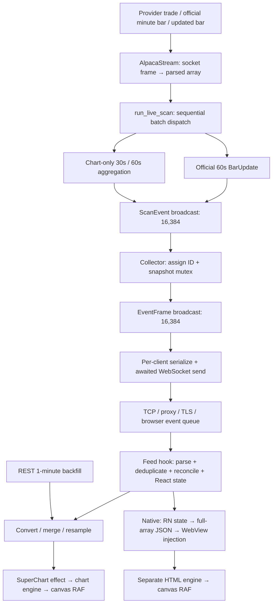

# Stockspotter live-chart fidelity and latency audit

**Review status:** isolated candidate; not deployed; not ready for an unconditional production promotion.

**Branch:** `audit/chart-fidelity-20260920` in `H:/wavystack/stockspotter-chart-audit`.
**Baseline:** `143cb8a`, the parent of the local V2.1 foundation revision `7e36586`.
**Scope:** received market data → chart candles, web rendering, reconnect completeness, and mobile/foldable considerations. V2.1 files, ranking logic, trading execution, deployment configuration and other checkouts were not modified. The V2.1 checkout still has HEAD `7e36586` and no tracked changes.

## 1. Decision summary

There are real correctness defects behind the apparent chart lag. The baseline only publishes a forming candle on a trade that arrives at least 500 ms after its previous publication. There is no trailing timer. A quiet final print can remain invisible indefinitely; a rollover can discard its OHLCV contribution from the displayed 30-second candle. An out-of-order trade can also reset the current bucket. These were reproduced against the extracted baseline implementation, not inferred from comparison with another app.

The isolated candidate fixes that chart aggregation, uses incremental web-series updates when safe, and stops resetting the viewport on each live update. In the local desktop replay, **source-to-canvas p99 decreased from 500.1 ms to 60.6 ms**. The baseline left **45/600 received trades unpublished** after input stopped; the candidate incorporated **600/600**. These results concern the controlled replay described below. They are not measurements of Alpaca's exchange-to-client latency or the deployed VPS.

**Fidelity is not fully solved.** Reconnect snapshots cannot reconstruct missing candle history; trade corrections/cancellations and upstream trade identities are discarded; partially observed live bars can overwrite fuller REST bars. These are explicit remaining release risks, with proposed fixes in §7. Robinhood was not used as an oracle or benchmark.

## 2. Evidence and measurement boundaries

### What was measured

Run: **2026-09-20 16:37 UTC**, Windows, Bun 1.4.0, headless Chromium **151.0.7922.34**, Rust debug fixture, Lightweight Charts **4.1.3**, installed locked client dependencies. No dependency versions were changed.

The loopback fixture runs the **actual `AlpacaStream` connection, authentication/subscription handshake and JSON parser**, the exact extracted baseline chart closure versus the new production `ChartBars`, and two instances of the **actual `ws-server/server.rs`**. Each instance uses both production-sized broadcast channels and the production snapshot/serialization/WebSocket path. The browser uses the actual `useRealtimeFeed`, reconciliation and conversion functions, React production runtime, and baseline/candidate Super Chart engines with all 12 series present. The configuration module alone is replaced by loopback URLs. Playwright blocks external requests and proxies the permitted WebSocket connections, adding common fixture overhead.

The source emits deterministic, ordinary trades at nominal 100 or 250 trades/s. Both variants receive the same input. Each trial uses a separate symbol and a 500-bar synthetic history. Source trade times are deliberately **04:00 ET premarket on 2026-09-18**, while separate measurement timestamps record when the replay actually sends and receives each trade. The source price encodes a monotonic sequence, and each trade contributes one share. The sequence and volume let the harness associate an emitted candle with every input incorporated into it.

Timing landmarks:

1. **Source:** local source timestamp immediately before sending its trade frame.
2. **Ingress:** Rust timestamp when `next_batch()` returns a parsed frame, before aggregation.
3. **Browser dispatch:** message listener timestamp before the real feed hook handles it.
4. **Submission:** `setBars()` entry and return.
5. **Canvas:** observed completion of actual canvas draw commands, checked in the subsequent animation-frame callback. A React commit or `setData` return alone does not qualify.

For each trade, latency ends at the first observed draw whose cumulative candle includes that trade. Coalesced updates are therefore accounted for; unpublished tails are reported separately rather than silently dropped from the population. The harness waits 1.2 seconds after the source finishes. Percentiles are nearest-rank, with no warm-up exclusions in the pipeline trials. Raw measurements include each input, parsed receipt, browser dispatch, draw sample and long task.

**Clock qualification:** source/browser timestamps use local `performance.timeOrigin + performance.now()`; Rust uses local UTC. These share one host, but inter-process clock offset/quantization was not independently calibrated. Sub-millisecond source→ingress figures are diagnostic only. Millisecond differences near zero are not evidence of a production SLA.

### What was not measured

- Exchange timestamp → provider receipt/publication, public network/TLS/Caddy delivery, production queue depth, real production data loss, or source clock synchronization.
- Full `run_live_scan` discovery/scoring/audit workload, all dashboard panels, many simultaneously active symbols, or multiple real clients competing for bandwidth. The fixture exercises the chart lane, not the whole scanner.
- Physical screen presentation/scan-out, GPU compositor completion, actual Android/iOS WebView bridge costs, device thermal throttling, battery use, or foldable hardware. “Canvas” means draw-command completion, not photons on screen.
- A representative multi-day workload or statistically independent repeated trials. These are reproducible diagnostic runs, not sustained-capacity certification.

Do **not** estimate transport latency as `now - BarUpdate.timestamp`: that field is the candle's bucket start. A valid 1-minute candle can be nearly a minute old while its update was delivered immediately. Browser RAF scheduling is also subject to display cadence and background suspension; see [MDN's RAF documentation](https://developer.mozilla.org/en-US/docs/Web/API/Window/requestAnimationFrame).

## 3. Architecture and delay inventory



| Stage / source | Queue, wait, batching or render cost | Audit result |
|---|---|---|
| Provider, `market-data/ws.rs`, `bar.rs` | Provider batches arrays; TCP/TLS/kernel buffering; one complete text frame parsed into a `Vec<AlpacaMessage>`. | No provider delay metric or ingress trace currently travels with events. Initial subscription consumes a whole acknowledgement frame; interleaved data in that frame is not returned to the caller. A parse failure rejects the frame and causes stream recovery. |
| Initial scan setup, `live.rs` | Daily seeds and per-symbol session REST fetches precede stream connection; the 15 s rescan worker scans and backfills before sending its result. | Startup/eligibility latency is distinct from post-ingress latency. A symbol may not yet qualify for a live chart even while wildcard trades are arriving. |
| Main `run_live_scan` loop | Sequential messages inside a received batch; no scheduler yield between chart/detector work. Shared locks, subscription/unsubscription socket writes, processing seeded history, and logging can delay the next read or chart flush. | 50–75 ms candidate coalescing is **not** a hard bound if the main loop stalls. Full scanner tail latency remains unmeasured. |
| Background/control work | Rescan MPSC capacity **1**, catalyst capacity **8**, mover-seed capacity **1**; rescan/audit ticks **15 s**, halt-watch/eviction ticks **60 s**. | Not deliberate per-candle waits, but work delivered into the dispatch loop competes with chart work. `managed_position_symbols()` synchronously reads/parses the entire trading journal on a halt-watch refresh. |
| Optional discovery capture | Nonblocking writer queue **65,536 records / 128 MiB**, flush batches **512**, buffered disk writer. Producer still encodes JSON and accounts for queued bytes. | This is not a candle transport queue. Capture loss and transport loss are different; an audit capture alone cannot establish complete ingress. Existing capture behavior was not changed. |
| Baseline provisional chart | **500 ms** leading publication, triggered only by new trades; no trailing flush, rollover inherits previous publication time. | Verified stale tails, rollover loss and out-of-order reset. |
| Candidate provisional chart | **50 ms** publication interval; **25 ms** periodic trailing flush with missed ticks skipped; first bucket immediate; rollover forces old dirty buckets before new bucket publication. | Typically up to 75 ms coalescing wait under an unstalled loop; one bounded correction window per tracked symbol/interval. Higher fanout load requires capacity validation. |
| Official minute/corrected bars | Provider `b` / `u` bypass provisional aggregation and emit `isFinal=true`. | No extra 500 ms chart throttle. Official bars and raw-trade previews do not have identical eligibility semantics. |
| Scanner broadcast | **16,384 events**, shared with other consumers. `send` does not backpressure ingestion. | Slow receivers lose events. Chart updates also compete with detector telemetry. |
| Snapshot collector | Receive, event-ID assignment, clone, JSON conversion for key, async snapshot mutex, second broadcast. | Overflow here logs a warning only. IDs are assigned **after** the lost input, so downstream ID continuity cannot detect that loss. |
| Retained snapshot | Up to **2,000 alerts + 5,000 latest keys**; chart key is `type:symbol:intervalSecs`, without bucket time. Snapshot clones/sorts under its lock. | Only the latest **arrival** per interval survives. A late old-bucket correction can replace the newer bucket in the reconnect snapshot. |
| Per-client fanout | Second **16,384-event** queue; JSON serialized separately per client; sequential awaited writes with **10 s** send timeout; **64** connection permits; **10 s** hello timeout. | Slow socket/snapshot replay can build a backlog. No chart-priority lane. Full-ring residence cannot be bounded by capacity alone. At an illustrative 4,000 events/s a ring represents only ~4.1 s. |
| Deployment transport | Repository Caddy `/ws*` reverse proxy to 8787, API proxy to 8788; OS buffers, congestion, TLS and client radio. | No explicit chart throttle in repository proxy configuration. Actual deployed configuration and buffering were not inspected; no Nagle/socket optimization was applied speculatively. |
| Web feed hook | `JSON.parse`, 20,000-ID dedup set, separate 30s/60s maps, **500 bars/symbol**, full timestamp-map/sort reconciliation, cloned map and React state updates. | No explicit client candle debounce found. React/event-loop scheduling and unrelated state updates can delay drawing. 500 bars retain only 4h10 at 30s or 8h20 at 1m, not a full 16-hour extended session. |
| ChartPanel / history | REST backfill on symbol selection: **240 minutes**, paginated `1Min` requests using configured feed. Convert/sort, live-wins merge, numeric timeframe resampling. ChartPanel depends on whole symbol maps. | Unrelated symbol updates can cause additional chart derivation. No reconnect-triggered history repair; HTTP errors are silently best-effort. REST uses a newly constructed client and has no explicit request timeout in this helper. |
| Baseline web engine | Recompute all indicators, including hidden ones; replace all 12 full series; `fitContent()` every update; canvas RAF and ResizeObserver. | Excess work and user pan/zoom loss verified. |
| Candidate web engine | Same indicator math; compare data, use `update()` only for unchanged history + tail changes/appends; full replacement for history corrections/eviction/reset; fit on initial content or explicit timeframe choice. | Remains O(N) for indicator calculation/comparison, but avoids repeated library data ingestion. No candle math approximation. |
| Other UI work | Updated-age timers 1 s; trader/market/mover panels poll at 15 s / 60 s, sparklines at 5 min; notifications and multi-chart rendering. | Compete for browser time; not measured by the isolated one-chart harness. |
| Native mobile | Separate React feed → conversion/resampling → full-array `JSON.stringify` → `injectJavaScript` → separate HTML engine → all-series replacement + `fitContent` → WebView RAF. | Web engine changes do not automatically optimize this duplicate engine. See §8. |

Primary implementation references: [ingress](../crates/market-data/src/ws.rs), [dispatch](../crates/market-data/src/live.rs), [new chart aggregation](../crates/market-data/src/chart_bars.rs), [fanout/snapshots](../crates/ws-server/src/server.rs), [web feed](../apps/client/src/lib/useRealtimeFeed.ts), [chart panel](../apps/client/src/components/panels/ChartPanel.tsx), [web engine](../apps/client/src/lib/superChartEngine.ts).

## 4. Latency distributions and long-tail stalls

### Local synthetic source → canvas, milliseconds

Percentiles exclude inputs never incorporated in a drawn candle; that count is shown in the last column. **Baseline percentiles are therefore optimistic about completeness.**

| Trial | Variant | Measured/input count | p50 | p90 | p95 | p99 | Maximum | Unpublished at end |
|---|---|---:|---:|---:|---:|---:|---:|---:|
| Sparse premarket, 30s, 2 trades 10 ms apart | Baseline | 1/2 | 13.9 | 13.9 | 13.9 | 13.9 | 13.9 | 1 |
| Same | Candidate | 2/2 | 27.5 | 49.3 | 49.3 | 49.3 | 49.3 | 0 |
| Desktop 1440×900, nominal 100 Hz, 1m | Baseline | 555/600 | 256.8 | 455.8 | 479.0 | 500.1 | 506.1 | 45 |
| Same | Candidate | 600/600 | 27.4 | 49.4 | 57.8 | 60.6 | 71.4 | 0 |
| Phone-sized 390×844, DPR 2, 4× CPU, 100 Hz, 30s; injected 750/150 ms main-thread stalls | Baseline | 559/600 | 341.9 | 714.7 | 981.1 | 1223.5 | 1278.5 | 41 |
| Same | Candidate | 600/600 | 54.1 | 207.6 | 524.0 | 788.5 | 854.9 | 0 |
| Foldable-sized 720×800 ↔ 360×780, DPR 2, 4× CPU, 250 Hz, 1m; six resizes | Baseline | 1112/1200 | 281.1 | 482.1 | 507.3 | 527.3 | 537.4 | 88 |
| Same | Candidate | 1200/1200 | 48.3 | 70.4 | 74.3 | 81.1 | 87.7 | 0 |

The candidate's first sparse print was slower in this single run (27.5 versus 13.9 ms); the important sparse result is delivery of the second trade, which the baseline never published during observation. No claim of uniformly faster individual frames is warranted.

### Once Stockspotter has parsed the input: ingress → canvas

| Trial | Baseline p50 / p95 / p99 / max | Candidate p50 / p95 / p99 / max |
|---|---|---|
| Desktop | 256.6 / 478.9 / 499.9 / 505.9 | 27.2 / 57.6 / 60.5 / 71.2 |
| Phone-sized + stalls | 341.7 / 980.9 / 1223.3 / 1278.4 | 54.0 / 523.9 / 788.3 / 854.7 |
| Foldable-sized + resizing | 281.0 / 507.1 / 527.2 / 537.3 | 48.2 / 74.1 / 81.0 / 87.5 |

The local source→parsed-ingress p99 values were 0.337 / 0.270 / 0.262 ms respectively; those figures are clock-qualified as above. They are not upstream market-feed measurements.

The deliberately stalled phone trial had **119 baseline versus 33 candidate trades above 500 ms**, and **497 versus 84 above 100 ms**. Browser long-task records are retained. Lower server throttling cannot eliminate a blocked browser main thread. Measuring only dispatched WebSocket messages would conceal part of that stall because queued frames have not reached their JavaScript listener yet; the source and ingress landmarks preserve it.

All **2,402 source trades reached parsed ingress**. Across these finite trials, the baseline left 175 trades unpublished; the candidate left none. This is verified local completeness, not evidence of zero provider or production transport loss.

### Independent render-cost comparison, identical inputs

Separate trial: 500 bars, 4× CPU throttling, 220 identical-sequence tail updates per variant, first 20 excluded as warm-up, one RAF between updates. Values measure synchronous `setBars`, not the complete frame.

| Engine | n | p50 | p95 | p99 | Maximum |
|---|---:|---:|---:|---:|---:|
| Baseline full replacement | 200 | 10.5 ms | 13.4 ms | 15.2 ms | 20.1 ms |
| Candidate incremental writes | 200 | 3.4 ms | 4.8 ms | 5.4 ms | 5.6 ms |

At a manually selected logical range `[100,200]`, a baseline live update reset the range to `[0,501]`; the candidate preserved `[100,200]`.

Evidence: [raw pipeline samples and distributions](../tools/chart-audit/results/latency.json), [independent engine measurements](../tools/chart-audit/results/engine.json), [desktop screenshot](../tools/chart-audit/results/desktop-100hz-after.png), [phone-sized screenshot](../tools/chart-audit/results/phone-4x-100hz-stalls-after.png), [foldable-sized screenshot](../tools/chart-audit/results/foldable-4x-250hz-resize-after.png). Screenshots use deliberately synthetic history and are visual evidence of mounted/drawn charts, not representative market price action.

## 5. Candle fidelity and deterministic checks

### Boundary and OHLCV contract

- Buckets are half-open UTC intervals: `[floor(t / interval) × interval, next boundary)`. Nanoseconds immediately before a boundary stay in the old candle; exact-boundary prints start the new candle.
- Tests explicitly cover **30 / 60 / 300 seconds**, summer 04:00 ET = 08:00 UTC, winter 04:00 ET = 09:00 UTC, and summer/winter 09:30 ET opens. Existing session-classification tests also pass.
- The new chart accumulator uses source event time for open/close, maximum/minimum for high/low and sum of received valid trade sizes for volume. Equal-time trades use arrival order because the current type has no exchange sequence or trade ID.
- A stable sorted-trade oracle checks mixed-order inputs, equal timestamps, nanosecond boundaries and rollover. Web resampling checks 5-minute OHLCV with missing minutes, without inventing synthetic zero-volume candles. A 5-minute candle is a resampling of available 1-minute bars, not a separate live provider subscription.
- Official `isFinal=true` 1-minute bars cannot be overwritten by a delayed provisional update; an official correction can replace an official bar. This is verified through reconciliation and 5-minute aggregation.
- Real browser series data was compared with the full-replacement engine for seven cases: initial history, tail change, append, old-candle correction, history eviction, timeframe-shaped reset and empty reset. **All 12 series matched in all cases.**

### Reproduced baseline errors

1. Prints `(10,2 shares)` and `(15,3 shares)` immediately before a 30s boundary should leave previous OHLCV `(10,15,10,15,5)`. The baseline published only high **10**, volume **2**, then replaced its bucket state. Candidate rollover publishes the missing tail first.
2. Current-bucket print `(20,4)`, late previous-bucket print `(8,1)`, then current print `(21,5)` caused the baseline to retain current open **21**, volume **5**. The candidate retains current open **20**, volume **9**, and independently updates the older bucket.
3. A sparse pair of trades inside the throttle interval produced no trailing publication in the baseline. Candidate timer-driven publication was verified both deterministically and through the browser replay.

The candidate retains **20 populated buckets per symbol per interval**, not an unlimited history. Older arrivals are rejected with counters and rate-limited warnings. Invalid/non-positive prices and zero-size trades are rejected. Buckets beyond that window, canceled/duplicated trades, or data never received cannot be reconstructed by this accumulator.

### Fidelity qualifications that remain

The local oracle is **Stockspotter's received valid raw trades**, not a claim to match every provider's official bar eligibility rules. Alpaca publishes premarket minute bars and later updated bars, and automatically supplies trade correction/cancel channels with trade subscriptions. Its documentation also distinguishes trade conditions used in official bar construction. The current parser preserves conditions but the chart accumulator does not implement official condition eligibility; correction/cancel messages become `Other`, and trade identity is discarded. See [Alpaca's documented stream contract](https://docs.alpaca.markets/us/docs/real-time-stock-pricing-data).

Consequently, raw previews can differ from authoritative provider bars even after the fixed arithmetic is correct. Do not describe 30-second candles as exchange-complete or official. Do not reconstruct missing 30-second OHLCV by splitting a 1-minute bar.

## 6. Reconnect and missing-data behavior

**Upstream reconnect:** `run_live_scan` exits on errors/closure and the supervisor waits **5 s** before restart, followed by seed/discovery/auth/subscription work. Chart state is rebuilt rather than replayed from an acknowledged trade offset. No exact trade replay or duplicate suppression is implemented. The existing idle timeout was recreated inside `select!`; frequent control ticks could continually reset its waiting period. The candidate uses one absolute 10-minute deadline reset only after a parsed batch. This repairs the timer bookkeeping, but 10 minutes remains too permissive for prompt detection of a transport that stays connected and sends nothing.

**Downstream reconnect:** web and native clients use a fixed **3 s** retry. Web heartbeat runs every **15 s**, closes a transport with no activity for over **45 s**, and marks market data stale beyond **90 s**. On reconnect, the server sends retained snapshot frames followed by live traffic; client event-ID dedup persists. This restores some latest state, not a complete time series. The snapshot characterization test confirms that several 30s candles collapse to one record and a late correction can make it an older record.

**Overflow:** per-client fanout lag emits `stream_lagged` and a snapshot for display clients; the auto-trader path disconnects instead. Upstream collector lag only logs a warning. The client stale indicator can clear on the next fresh timestamp even though older history remains missing. The bounded-channel test reproduces `Lagged(6)` after ten inputs into a four-slot ring; this verifies loss semantics, not a production loss count.

**Backfill:** web backfill runs on symbol changes, not reconnection or `stream_lagged`; 30s has no backfill. The REST/live merge has no completeness or provenance field and always lets live win. A characterization test demonstrates an authoritative-looking REST volume **1000** being replaced by a partially observed live volume **3**. Neither the candidate renderer nor a reconnect snapshot can repair that ambiguity.

**Interpreting gaps:** an empty minute may be a legitimate no-trade interval, ineligibility, an outage, queue loss, or collection starting mid-bucket. Existing data does not distinguish these reliably. Never fill gaps silently or infer missing trade counts from elapsed wall-clock time alone.

## 7. Implemented isolation and remaining priorities

### Implemented in this branch

1. Extracted chart-only aggregation into `chart_bars.rs`, with independent event-time buckets, bounded late updates, trailing publication and rollover flush. Detector math, inputs and thresholds were not modified.
2. Lowered forming-candle publication interval from 500 to 50 ms, with a 25 ms trailing tick. Changed preview eligibility to the same `momentum_windows` gate used by official minute chart bars, covering movers-only tracked symbols too.
3. Fixed the existing scanner idle deadline cancellation problem so the new chart timer cannot keep an idle socket alive indefinitely.
4. Added a type-safe per-series writer: latest-candle changes/appends use `update`; historical corrections, trims and resets retain full replacement. Indicator calculations remain unchanged. This respects [Lightweight Charts 4.1's update contract](https://tradingview.github.io/lightweight-charts/docs/4.1/api/interfaces/ISeriesApi#update).
5. Preserved pan/zoom during live updates; explicit timeframe selection still reframes.
6. Added deterministic correctness tests, baseline defect reproductions, snapshot/overflow characterizations, reproducible loopback latency tooling and raw evidence.

No experimental ranking code or deployment was changed. The shared scanner still carries additional chart traffic, so unchanged detector logic does **not** mean zero scheduling impact if this candidate is later deployed.

### Risks and proposed next changes, ordered by importance

| Priority | Risk | Proposed isolated follow-up / acceptance criterion |
|---|---|---|
| P0 fidelity | Reconnect/collector loss cannot repair missing history; UI can imply healthy while incomplete. | Add persistent chart gap state and a bounded, bucket-keyed replay/revision log. Signal collector loss to every display client. Reconcile 1m history after gaps; recover 30s from retained trades/bars or explicitly mark unavailable. Kill/reconnect and overflow tests must recover the oracle or keep the gap visible. |
| P0 fidelity | Lost trade IDs, correction/cancel messages and condition semantics. | Preserve feed + exchange/trade identity; apply dedup, cancellation and correction accounting in a chart-only ledger. Define raw-preview versus official eligibility explicitly. Test duplicated frames, canceling an extreme, corrected volume, and late official revisions. Do not change detectors as part of that work. |
| P0 fidelity | Partial live data replaces fuller REST history. | Carry coverage start, provenance, interval and revision/finality through merge. Seed/replay from a known watermark; never simply add overlapping volumes or choose their maximum as a substitute for reconciliation. Test startup mid-minute and HTTP responses racing live updates. |
| P1 capacity | 20 Hz publication is up to 10× the baseline per active symbol, and native still performs full redraws. | Load-test representative symbol/client counts with the full scanner and native devices before promoting the cadence. Consider a separate chart lane and per-client subscription/coalescing while preserving all aggregation inputs and final/correction events. Track queue occupancy and dropped spans. |
| P1 latency | Main scanner batch dispatch, sync journal reading, lock acquisition and subscriber work can stall chart timers. | Instrument main-loop residence and batch duration first; move journal parsing outside dispatch; bound CPU work between yields. Measure under recorded premarket/open bursts. Do not infer the full scanner tail from this isolated fixture. |
| P1 truthfulness | Snapshot key uses latest arrival; event ID is not trade sequence; health mixes transport activity and bucket timestamps. | Retain candle timestamp/revision in snapshot keys; show transport state, market activity and historical completeness independently. Maintain explicit loss metrics rather than clearing completeness on one fresh event. |
| P1 mobile | Duplicate WebView engine and full-array bridge; mobile improvement unverified. | Share tested series reconciliation/indicator code, introduce delta messages with revision/gap fallback, bundle the pinned chart library, and validate resume/fold behavior on real devices. |
| P2 efficiency | Per-client serialization; full-history sorts/calculation; unrelated-symbol re-renders. | Serialize immutable frames once after profiling; subscribe charts to selected-symbol slices; incremental indicators only after oracle parity tests for corrections and windows. Keep rendering coalesced without dropping OHLCV inputs. |
| P2 resilience | Fixed retry, no explicit REST timeout, snapshot flood, initial subscription-frame data discard. | Bounded HTTP deadlines/cancellation, jittered retry and staged recovery, preserve non-ack messages during subscription. Failure tests must identify gaps rather than synthesize prices. |

### Production measurement required before promotion

Add sampled trace landmarks at source event time, socket receipt, parse completion, aggregation, both queue enqueues/dequeues, serialization/send, browser receipt, React commit and canvas draw. Correlate with feed, trade identity, bucket and revision. Use monotonic durations within each process and clock-offset bounds for cross-host comparisons; log queue age/occupancy, source lag, event-loop long tasks and censored/unpublished inputs. Capture actual premarket and opening bursts. Obtain approval for the resulting concrete deployment separately; **this audit performs no deployment**.

## 8. Mobile and foldable assessment

The phone/foldable pipeline results above are **web Chromium simulations**. CPU throttling is a diagnostic multiplier, not a calibrated phone model; [Chrome documents its CPU-throttling controls here](https://developer.chrome.com/docs/devtools/performance/reference). Native Expo/WebView was inspected without changing its implementation.

Specific native costs/risks:

- `ChartScreen.tsx` serializes the entire displayed bar array for every update. The independent 500-bar fixture serialized to **45,153 bytes**: at 20 updates/s that is roughly **0.90 MB/s per chart before bridge overhead**, excluding settings/alerts. This is an illustrative payload calculation, not measured native bandwidth.
- `chartHtml.ts` independently recomputes all indicators, replaces all series and calls `fitContent` on each update. It loads the pinned library from `unpkg.com`; network/CDN availability affects first chart readiness.
- Empty arrays are skipped both before injection and inside `setBars`; a transition to unavailable/empty data can leave stale candles visible until the WebView is recreated. Preserve an explicit clear command and generation ID for symbol/timeframe changes.
- A ResizeObserver exists, but native fold/resume can interleave layout, WebView recreation, queued bridge messages and stale ready callbacks. Test cover → unfolded → landscape, rapid reversals, keyboard insets, and a resume with a feed gap. Preserve viewport and reject messages for the wrong chart generation.
- Browser/native background scheduling can pause rendering and networking. On resume, recover current data and completeness before presenting the chart as current; do not replay a backlog frame by frame.
- Higher pixel density and two canvases per pane increase GPU work and memory. Measure p95/p99 input-to-canvas, long tasks, dropped updates, memory, temperature and battery on actual low/mid-tier phones and a foldable. Retain full OHLCV even if the visible refresh cadence adapts.

## 9. Validation, reproduction and review handoff

Validation completed:

- `cargo test -p market-data --lib --offline --target-dir H:/wavystack/stockspotter-chart-audit-target --quiet`: **102 passed**.
- `cargo test -p ws-server --bin ws-server --offline --target-dir H:/wavystack/stockspotter-chart-audit-target --quiet`: **134 passed**.
- `cargo test -p ws-server --example chart_audit --offline --target-dir H:/wavystack/stockspotter-chart-audit-target --quiet`: **44 passed**, including included server/access tests and exact-baseline defect reproductions. These overlap the server suite; do not add them as unique coverage.
- `bun test apps/client/src/lib`: **64 passed**, 520 assertions.
- `bun run build` in `apps/client`: TypeScript and Vite build passed. Existing >500 kB chunk warning remains; produced main JS was approximately 963 kB / 294 kB gzip.
- Browser parity: seven datasets × twelve series, no differences in each trial; no page errors in the recorded run. Resizing trial incorporated all source trades. No real native-device certification was performed.

Reproduce in the isolated worktree, with no `.env` needed:

```powershell
bun install --frozen-lockfile --ignore-scripts --filter @stockspotter/client
cargo build -p ws-server --example chart_audit --offline --target-dir H:/wavystack/stockspotter-chart-audit-target
# Terminal 1: loopback source + measurement page; rebuilds fixture browser bundle
bun tools/chart-audit/serve.ts
# Terminal 2: actual parser + baseline/candidate server fanout (never main ws-server)
H:/wavystack/stockspotter-chart-audit-target/debug/examples/chart_audit.exe
# Terminal 3: set these to local Playwright Core and Chromium installations
$env:PLAYWRIGHT_MODULE='C:/Users/trfm1/AppData/Local/npm-cache/_npx/e41f203b7505f1fb/node_modules/playwright-core'
$env:CHROME_PATH='C:/Users/trfm1/AppData/Local/ms-playwright/chromium-1234/chrome-win64/chrome.exe'
node tools/chart-audit/measure.cjs
node tools/chart-audit/engine-measure.cjs
```

Ports **19871–19874** bind to loopback. The fixture uses a public dummy token scoped to its own process, never production credentials. Start fresh fixture processes for each repeat so symbol state and source receipts do not carry over. Rust fixture `legacy.rs` contains the baseline closure extracted from `143cb8a`; `baseline-engine.ts` contains that revision's engine with only import paths adapted. Generated browser bundles are ignored. Raw JSON and screenshots accompany this one report.

**Recommendation for review:** retain the tested chart aggregation and incremental-rendering changes as an isolated candidate. Resolve the P0 completeness/provenance issues and validate native/multi-symbol capacity before promoting the faster cadence. The measured improvements are real within the stated boundary; production end-to-end latency and full market-data fidelity remain unproven.
